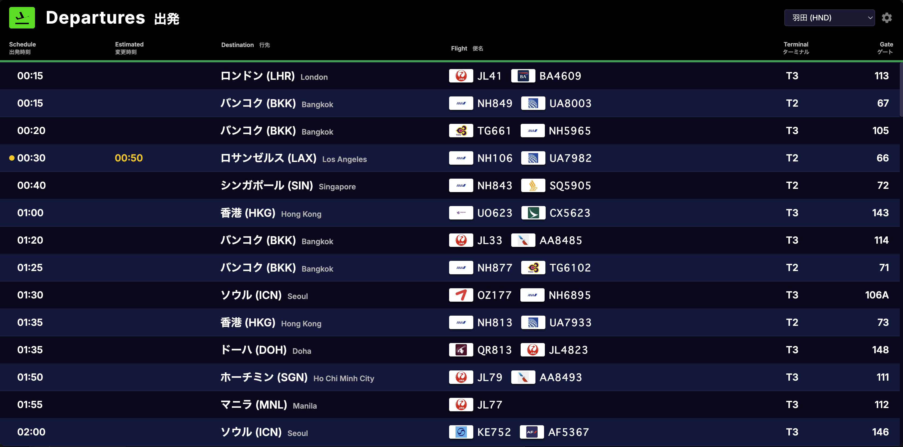

# Desktop Flight Board

A beautiful, frameless desktop widget built with Electron and Python that displays real-time airport departure information using the FlightRadar24 API.



## Features
- **Premium UI:** Dark theme, frameless, and transparent background. Matches the aesthetics of modern airport information boards.
- **Real-time Data:** Fetches live flight data using `FlightRadarAPI`.
- **Airline Logos:** Automatically displays official airline logos using Kiwi.com CDN.
- **Multi-Airport Support:** Easily switch between Haneda (HND), Narita (NRT), JFK, and Zurich (ZRH) from the settings menu.
- **Multilingual Support:** Translates major cities to Japanese automatically.
- **Scrollable:** Scroll through flights seamlessly when there are many departures.

## Prerequisites
- Node.js
- Python 3

## Installation

1. **Install Node.js dependencies:**
   ```bash
   npm install
   ```

2. **Set up Python environment (Required):**
   This application relies on a Python script to fetch flight data. It assumes a virtual environment (`venv`) exists in the project root.
   ```bash
   python3 -m venv venv
   source venv/bin/activate  # On Windows use `venv\Scripts\activate`
   pip install -r requirements.txt
   ```

## Usage

Start the Electron application:
```bash
npm start
```

## How to Customize
- **Add more airports:** You can add more airports to the dropdown menu in `index.html`.
- **Add city translations:** Expand the `cityTranslations` dictionary in `renderer.js` to translate more cities to your local language.
- **Change update frequency:** Modify the `setInterval` in `renderer.js` (default is 60,000ms / 1 minute).

## Note
This project uses the unofficial `FlightRadarAPI` (v1.5.3) for educational purposes. Please respect FlightRadar24's terms of service and do not spam the API with excessively frequent requests.

